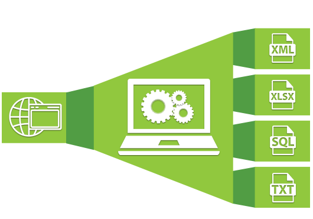

# Web-Scraper


## Requirements
### Python modules:
BeautifulSoup, requests, wordpress-xmlrpc 2.3
##### BeautifulSoup
`pip install beautifulsoup4`
##### requests
`pip install requests`
##### wordpress-xmlrpc 2.3
`pip install python-wordpress-xmlrpc 2.3`

## Overview
* It is a demonstration of using modules like [**BeautifulSoup**](https://www.crummy.com/software/BeautifulSoup/bs4/doc/) and [**Requests**](http://docs.python-requests.org/en/master/) which helps in **Web Scraping** in **Python**.
* You can just scrape the content of any desired page into a `.txt` or `.cvs` file on your system.
* It has **Real Time monitoring** that means it will keep checking for any new content that needs to scraped and posted on the website.
* The Project also uses [**wordpress-xmlrpc 2.3**](https://python-wordpress-xmlrpc.readthedocs.io/en/latest/). It is a Python library to interface with a WordPress blog's XML-RPC API.

## Work under the hood
* The two scripts `WebScraperMonitor.py`(Real Time Monitoring) and `WebScraper_NoMonitor.py`(No Real Time Monitoring) scrapes the data from government sets and save it on your system in the form of a `.txt` file.
* The script `ImportingToWordpress.py` iterate through the scraped text files on your system and post a **New Post** for every file on the website.
* The script `Web-Scraper.py` scrapes the content of the new link available(on the government owned website) directly into a New Post on the website. It reads the suffix of the link(from which data needs to be scraped) and suffix of the heading for every post for the website from two text file.

## Additional Features
To Automate the **Web-Scraper** I have made a `batch` file which runs `Web-Scraper.py` script or `Web-Scraper.exe` (can be made by using Pyinstaller).
#### Creating `.exe` application for Automation
Open command line and type:<br>
```
>pip install pyinstaller
>pyinstaller Web-Scraper.py
```
Then set task for the created `batch` file using [Task Scheduler](https://support.microsoft.com/en-us/help/814596/how-to-use-schtasks-exe-to-schedule-tasks-in-windows-server-2003) (for Windows) or [Cron Job](https://askubuntu.com/questions/2368/how-do-i-set-up-a-cron-job) (for Linux).<br>
**Web-Scraper** will run on the desired time and day and will scrape the new data on the website.


## About The Project
This Project was part of my Internship. You can see the Scraped Data from Government owned website <a href="http://judis.nic.in/">judis.nic.in</a> on the website of the Employer <a href="https://legalwiki.in/">LegalWiki.in</a>.

#### NOTE
>The source from where the data is scraped is unavailable right now maybe because it has been shifted to a new address. [This](http://judis.nic.in/supremecourt/imgst.aspx?filename=1) is one of the Links.
